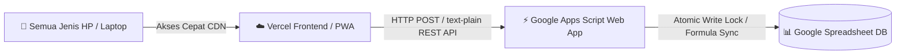

# FJB Operations Control System (v2.6.5)
**PT. FORTUNA JAYA BERSAUDARA**

Sistem Monitoring & Kontrol Operasional Unit, Manpower, Roster Kerja, dan Produksi Tambang berbasis Cloud yang responsif, super cepat, dan sangat enteng diakses dari segala jenis perangkat (Android, iPhone/iOS, Tablet, Maupun Laptop/PC).

---

## 🌟 Fitur Utama
- **Dashboard Operasional Real-Time:** Monitoring harian dan rekap 1 bulan penuh (HM Unit, Produksi, Manpower, Jam Hujan/Slippery, Availability).
- **Master Data Cepat & Massal:** Mendukung Bulk Editing tabel langsung dan fitur **Paste dari Excel / Google Sheets** (1x klik simpan massal).
- **Konfirmasi Modern & Interaktif:** Modal konfirmasi berbasis tingkat risiko (*Danger, Warning, Success, Info*) dengan efek visual modern.
- **Dukungan Mobile PWA (Progressive Web App):** Tampilan otomatis menyesuaikan layar HP (*responsive layout*) dan dapat di-install ke layar utama (*Add to Home Screen*) tanpa perlu download dari Play Store / App Store.
- **Dual Cloud Architecture:** Frontend berkecepatan tinggi di **Vercel** + Database real-time di **Google Spreadsheet** melalui Google Apps Script REST API.

---

## 🏗️ Arsitektur Sistem



---

## 🚀 Panduan Setup & Deployment

### 1. Setup Backend Google Apps Script (`code.gs`)
1. Buka Google Spreadsheet utama FJB.
2. Klik menu **Extensions (Ekstensi)** > **Apps Script**.
3. Buka file `Code.gs`, hapus kode lama, lalu paste seluruh isi file [`code.gs`](code.gs).
4. Klik **Save** (Ctrl+S).
5. Di toolbar atas, pilih fungsi `setupFJBSystem` lalu klik **Run (Jalankan)** untuk inisialisasi sheet (non-destructive). Izinkan hak akses Google.
6. Untuk mempublikasikan API:
   - Klik tombol **Deploy** (kanan atas) > **New deployment**.
   - Klik ikon gerigi ⚙️ > pilih **Web App**.
   - Isi deskripsi: `FJB Operations API v2.6.5`.
   - **Execute as:** `Me (email Anda)`.
   - **Who has access:** `Anyone` *(Penting agar Vercel & HP bisa mengakses)*.
   - Klik **Deploy**.
   - Salin **Web App URL** (format: `https://script.google.com/macros/s/AKfycb.../exec`).

### 2. Hubungkan ke Vercel (1-Klik Deploy)
1. Repository GitHub: [https://github.com/fjb01pm-prog/Fjb01Operation](https://github.com/fjb01pm-prog/Fjb01Operation)
2. Buka dashboard Vercel: [https://vercel.com/fjb01pm-2896](https://vercel.com/fjb01pm-2896)
3. Klik **Add New...** > **Project** (atau buka [Import Project Vercel](https://vercel.com/new/import?s=https://github.com/fjb01pm-prog/Fjb01Operation)).
4. Pilih repository `Fjb01Operation`.
5. Framework Preset: **Other** (Root Directory: `./`).
6. Klik **Deploy**.
7. Dalam 15-30 detik, aplikasi Anda sudah online di alamat domain Vercel (misal: `https://fjb01operation.vercel.app`).

### 3. Menghubungkan Frontend Vercel ke Spreadsheet
1. Buka link Vercel Anda di browser HP / Laptop.
2. Di layar login atau navbar atas, klik tombol **☁️ Atur API** (atau ikon Cloud).
3. Tempelkan (*paste*) **Web App URL** yang Anda salin dari Google Apps Script tadi.
4. Klik **⚡ Tes Koneksi**. Jika muncul tanda hijau ✅ *Koneksi Sukses*, klik **💾 Simpan Konfigurasi**.
5. Aplikasi kini 100% terhubung ke Google Spreadsheet Anda!

---

## 📲 Cara Install Aplikasi di HP (PWA)

Aplikasi FJB Operations Control dirancang sangat enteng (< 1 MB) dan dapat diinstall langsung:

### Di HP Android (Chrome):
1. Buka link Vercel aplikasi di Google Chrome.
2. Ketuk ikon titik tiga (⋮) di kanan atas.
3. Pilih **Tambahkan ke Layar Utama** (*Add to Home screen*) atau **Install Aplikasi**.
4. Ikon **FJB Ops** akan muncul di layar menu HP Anda dan dapat dibuka seperti aplikasi Android native (layar penuh tanpa address bar).

### Di iPhone / iPad (Safari):
1. Buka link Vercel aplikasi di Safari.
2. Ketuk tombol **Bagikan** (*Share* - ikon kotak panah ke atas di bagian bawah).
3. Gulir ke bawah dan pilih **Tambah ke Layar Utama** (*Add to Home Screen*).
4. Ketuk **Tambah** (*Add*).

---

## 👥 Akun Demo Sistem

| Role | NIK / NRP | Password |
| :--- | :--- | :--- |
| **ADMIN** | `9000001` | `admin123` |
| **GL / PENGAWAS** | `3102001` | `gl12345` |
| **OPERATOR** | `3101021` | `op12345` |
| **MECHANIC** | `4102101` | `mech12345` |

---

## 📁 Struktur File Repository

```text
├── index.html        # Entrypoint web app untuk Vercel & Browser HP (PWA ready)
├── index.txt         # Template HTML untuk Google Apps Script Web App
├── code.gs           # Backend Apps Script (Atomic locks, DB engine, & REST API)
├── vercel.json       # Konfigurasi SPA routing, clean URLs, & HTTP headers Vercel
├── manifest.json     # PWA manifest untuk Android & iOS home screen app
├── package.json      # Metadata proyek
├── .gitignore        # Filter file lokal & scratch
└── README.md         # Dokumentasi resmi
```

---
*Dikembangkan untuk PT. FORTUNA JAYA BERSAUDARA &bull; 2026*
